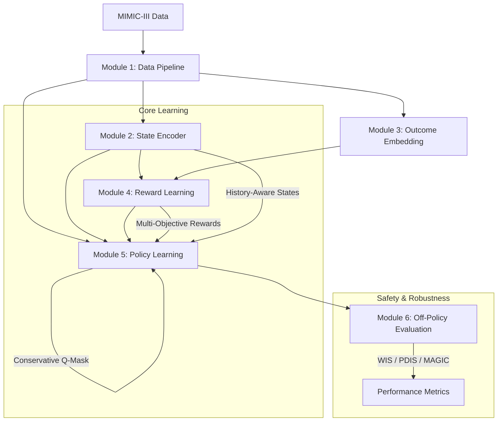

# Safe Offline Reinforcement Learning with Hierarchical and Multimodal Architectures for Personalized Sepsis Care

This repository contains a state-of-the-art implementation of an Offline Reinforcement Learning pipeline designed for personalized sepsis management in the ICU. The project utilizes the MIMIC-III dataset to learn optimal treatment policies that balance multiple clinical objectives while maintaining safety constraints.

## 🚀 Key Innovations

- **Acuity-Conditioned Decision Transformer (AC-DT):** A novel transformer architecture that conditions treatment actions on patient severity (SOFA score) and multi-objective returns.
- **Multi-Objective Reward Learning:** Learns vector-valued rewards from clinical preferences without hand-crafted reward functions, preserving the Pareto frontier of treatment trade-offs.
- **History-Aware State Encoding:** Uses recurrent neural networks (GRU) to process the full longitudinal history of patient vitals and labs.
- **Outcome Embedding:** A self-supervised transformer model that embeds future patient trajectories into a clinically meaningful latent space.
- **Continuous-Time Modeling:** Handles irregular clinical sampling intervals using Fourier time embeddings.
- **Safety-Aware Masking:** Implements conservative Q-learning (CQL) to mask potentially dangerous actions (e.g., extreme fluid or vasopressor dosing).

## 🏗️ System Architecture



## 📁 Project Structure

```text
src/
├── notebooks/          # Research and implementation modules
│   ├── module1.ipynb   # Data Pipeline & Cohort Selection
│   ├── module2.ipynb   # History-Aware State Encoder
│   ├── module3.ipynb   # Outcome Embedding Model
│   ├── module4.ipynb   # Multi-Objective Reward Learning
│   ├── module5.ipynb   # Offline Policy Learning (AC-DT)
│   └── module6.ipynb   # Off-Policy Evaluation (OPE)
├── utils/              # Shared production code
│   ├── data_pipeline.py # Dataset classes, feature extractors, and builders
│   └── models.py        # Shared model architectures (GRU, Transformers)
├── models/             # Serialized model checkpoints (.pt)
└── charts/             # Visualizations and performance plots
```

## 📝 Module Details

### Module 1: Data Pipeline
Extracts a sepsis cohort from MIMIC-III using the Angus criteria. Handles feature extraction for vitals, labs, and derived scores (SOFA, SIRS), along with action discretization for fluids and vasopressors.

### Module 2: History-Aware State Encoder
Implements a GRU-based encoder that processes patient history. It is pre-trained using Next-State Prediction and Contrastive Predictive Coding (CPC) to provide rich, temporally-aware state representations.

### Module 3: Outcome Embedding Model
Uses a Transformer encoder to process future trajectory segments (24-48h). It predicts mortality and learns a "good outcome" reference vector in the latent space, used for similarity-based reward grounding.

### Module 4: Multi-Objective Reward Learning
Learns vector-valued rewards from trajectory comparisons. It uses a probabilistic Bradley-Terry model and stratified pair sampling to avoid dense-region bias in the state space.

### Module 5: Offline Policy Learning
The core treatment engine. Implements the **Acuity-Conditioned Decision Transformer**, which predicts the next clinical action based on state history, multi-objective return-to-go, and current patient acuity.

### Module 6: Off-Policy Evaluation
Robustly evaluates the learned policy against clinician behavior using:
- **WIS (Weighted Importance Sampling)**
- **PDIS (Per-Decision Importance Sampling)**
- **MAGIC (Most Advanced Generalized Importance Sampling)**

## 🛠️ Setup & Requirements

### Data Access
This project requires access to the **MIMIC-III** database. Place the CSV files in the `data/` directory at the project root (or update the `DATA_DIR` path in the notebooks).

### Dependencies
- Python 3.10+
- PyTorch 2.0+
- Pandas, NumPy, Scikit-learn
- Mermaid.js (for viewing diagrams in GitHub)

## 📊 Usage
The notebooks are designed to be run sequentially (1-6). Each module builds upon the previous one, saving intermediate models to the `models/` directory. For production use, the classes in `utils/` can be imported directly into other scripts.
